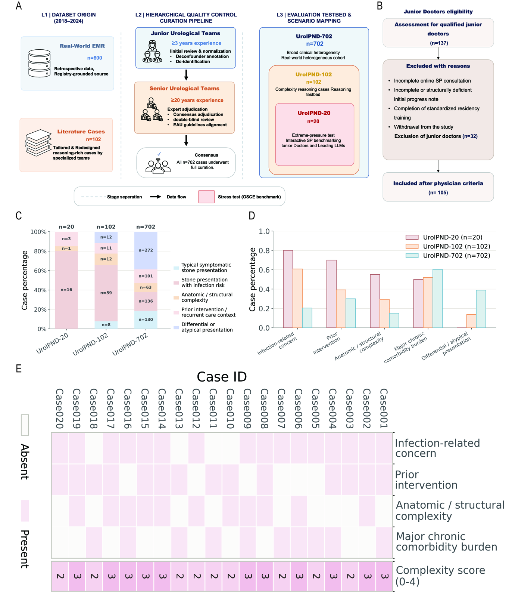
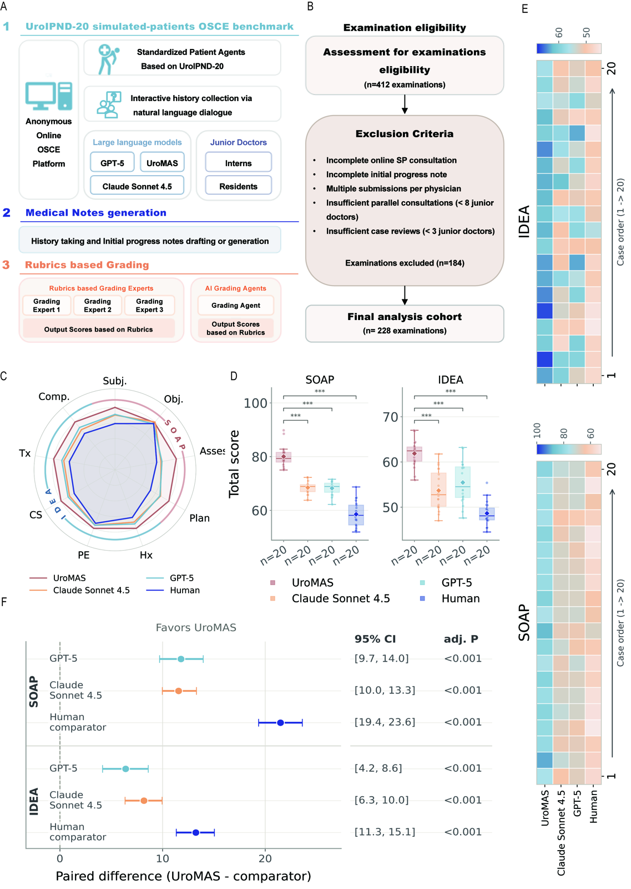

# 视觉参考文件

以下条目只是图片参考。转换脚本记录了尺寸和预览路径，但不会从图片内容中推断样式规则、样本量、panel 内容或研究事实。

正式绘图仍以 `Figure 统一参数.docx` 和第一作者主绘图要求为准；视觉参考图不能覆盖“可编辑 PDF”交付要求。

| 来源文件 | 尺寸 | 色彩模式 | 原始字节数 | 预览 |
| --- | --- | --- | ---: | --- |
| `plot/raw/style_references/Figure1.tif` | `3861 x 4503` | `CMYK` | 75402948 | `plot/agent_readable/assets/visual_reference_previews/Figure1_preview.png` |
| `plot/raw/style_references/Figure2.tif` | `4381 x 6165` | `CMYK` | 115126896 | `plot/agent_readable/assets/visual_reference_previews/Figure2_preview.png` |

## `plot/raw/style_references/Figure1.tif`

## `plot/raw/style_references/Figure2.tif`

