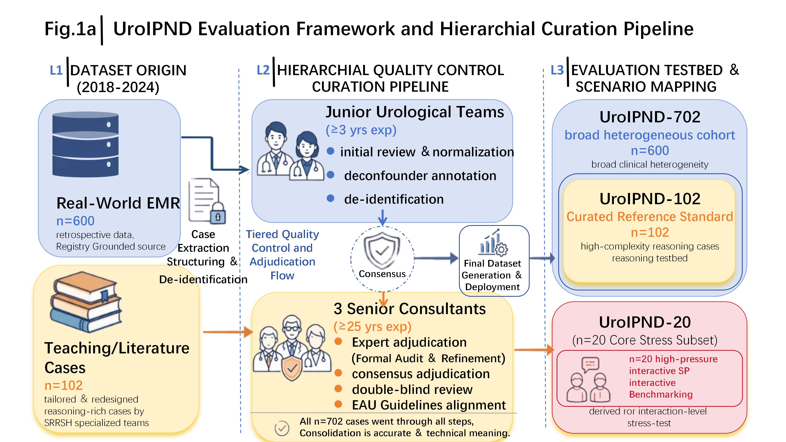
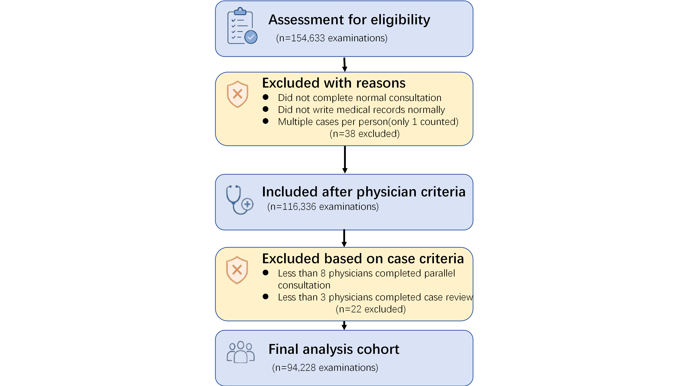
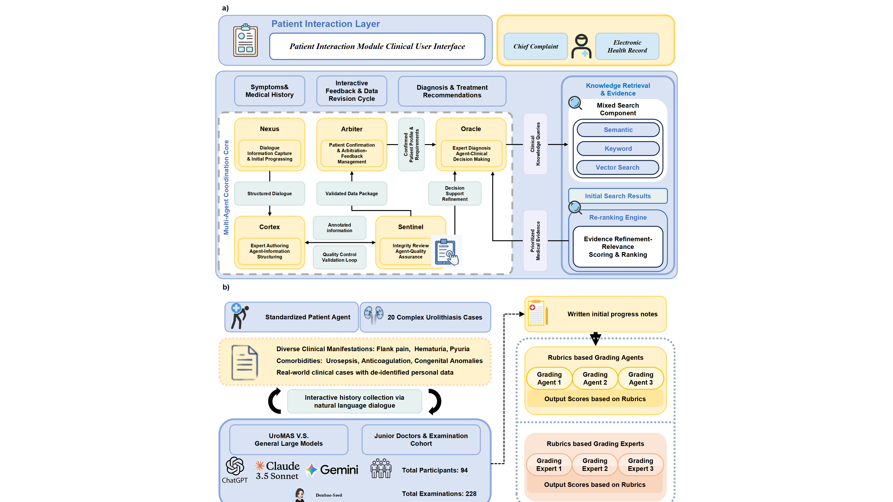

# 绘图修改

## 画幅规范

只允许三种 `figsize`：4.5 × 4.5、4.5 × 9.0、9.0 × 4.5。

> 注意：尽可能使用 4.5 × 4.5；调整画幅时，严禁删减画面中原有的任何元素（包括文字）！精心排布，减少覆盖。尽可能使画面撑满画幅，减少大面积留白。

## 字号规范

只允许三种 `fontsize`：8、11、6.5。

> 注意：尽可能使用 8。

## Figure1

### 1A、1B、2A、3A、4A。

流程图对复杂度、美观度要求高，难以用代码生成，因此我将在GPT官网生成，然后用PPT手工临摹。请为GPT官网撰写详细提示词，图片风格模仿另外三篇论文的流程图，如下（由你三选一，选定比例），但配色风格贴近绘图参数.md，且换色要有实际含义，不能随意换色。

### 1B

同1A理。

## Figure2

### 2A

同1A理。

### 2C

“Annotations flag adverse MAS differences that are both statistically significant and exceed the prespecified scale-specific margin.”一句过长，导致两侧大量留白、浪费空间，应尝试换行、缩句或删除。此图比例未能实现严格1:2，请排查原因并解决。

### 2E

画面中上部元素离“Mixed model: source × cognitive level + rating order, with crossed random rater and item intercepts; stars show adjusted source contrasts.”一句太远，浪费空间。考虑模仿3D排布。

## Figure3

### 3F

4.5 × 4.5。

## Figure5

### 5A

颜色太恶心，像呕吐物。美观一点。

### 5C

存在覆盖。

## 拼接成Figure

将各个Figure的Panels拼接，合理平衡“顺序序号”与“图片比例”，尽可能使拼成的Figure是一个矩形，而不是缺一个角。为1A、1B、2A、3A、4A留出位置。
