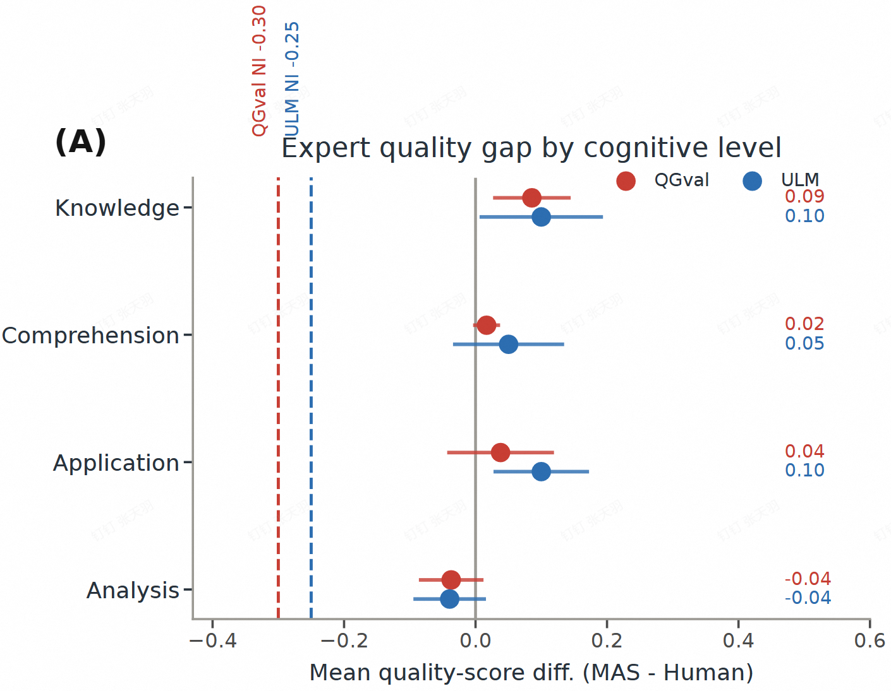
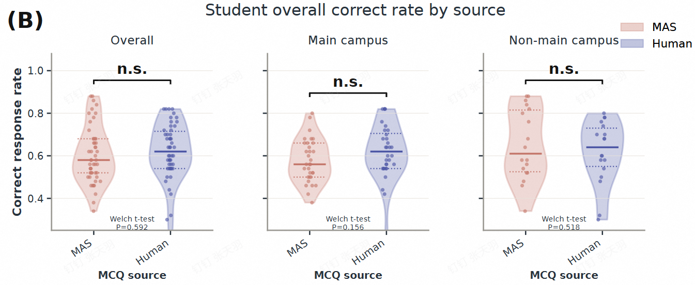
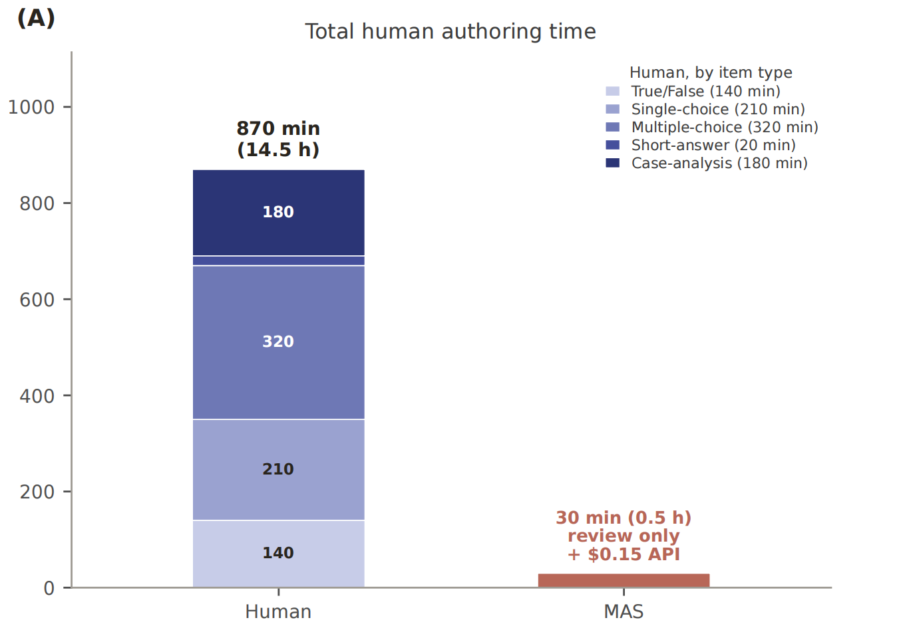
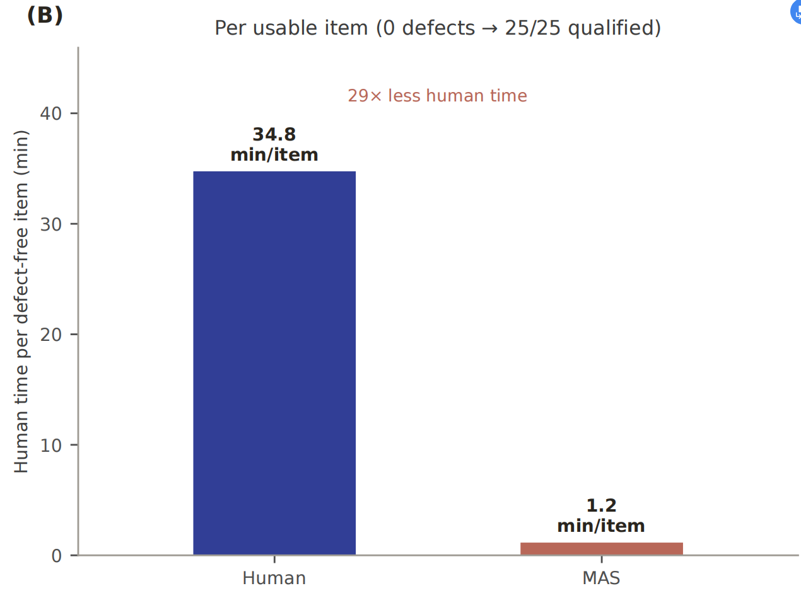
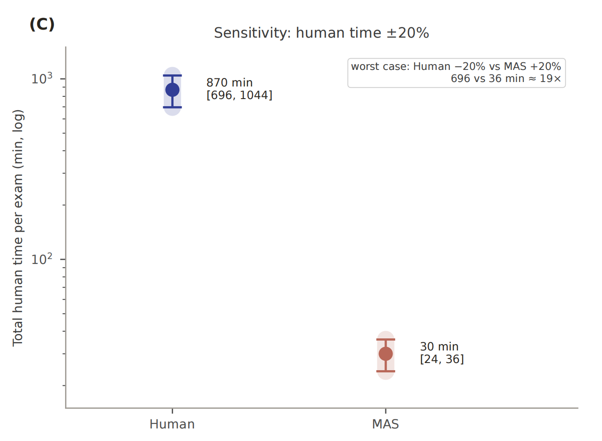
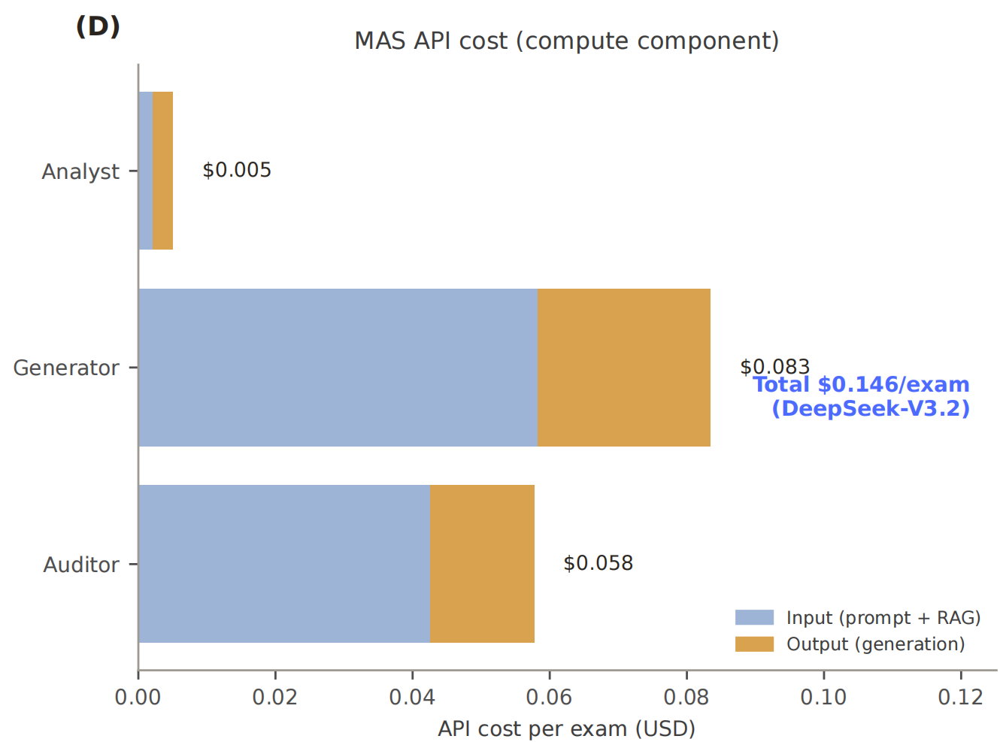

# 绘图修改

> 注意：以下修改尽可能不与 绘图参数.md 相违背。

## plot\panels\Figure2B_quality_difference.pdf

保持配色、参数、逻辑不变；图注严格模仿下图：

此外，阴影的边界虚线应与相应阴影对齐。

## plot\panels\Figure2C_dimension_scores.pdf

在 Completeness 指标柱状图右侧标注***

在其余指标柱状图右侧标注n.s.

所有n.s.（包括***）右对齐。

## plot\panels\Figure2D_quality_by_cognitive_level.pdf

保持配色、参数、逻辑、序号（D）不变；图注严格模仿下图：

## plot\panels\Figure3B_student_correct_rate.pdf

保持配色、参数、逻辑、序号（B）不变；图注（包括图例、n.s.）严格模仿下图：

## 新增Figure5：效率分析的A、B、C、D

- 逻辑、图注，适当模仿我另一篇论文的图片：

- 5A展示总时间并用分不同颜色展现每种**题型**（指A1、A2、A3/A4、B、X）的**单题**用时。注意AI部分要加上完整工作流全部时间，包括自动审核，自动评价，字段相似度分析等全部时间我们要体现工作流的效率依旧远低于人工。5C展示±20%敏感性后的结果，5D展示成本，均和上图A,C,D类似即可。

- 数据来自 效率分析.xlsx、timing_runs。若缺失任何数据，合理推断，合理补齐。尽可能查看出题流程、出题提示词、评题提示词，计算tokens，推算成本。

- 注意我使用的模型是deepseek-v4-flash、deepseek-v4-pro。

## 新增Figure6：学生疲劳分析

- 是指分析学生是否会被“先做哪张卷子、后做哪张卷子”而影响。

- 数据很可能来自 试卷作答情况.xlsx 与 试卷作答情况 - 2.xlsx 中的疲劳分析与总时长。

## 完成之后，将根目录所有.xlsx以CSV形式整合到plot\derived_data，并删除根目录所有.xlsx。
