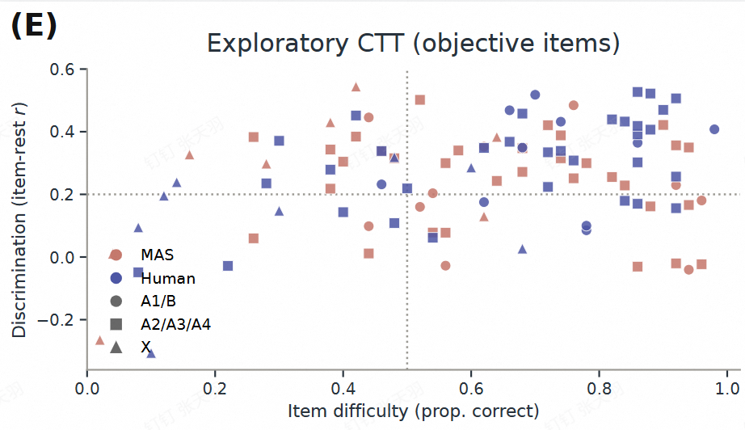

# 绘图再修改

## 第一

2D的示例和最上的数据线重叠了，换个位置。

## 第二

2E改称为2F，并在Codex对话框中告知我一致性测试用的是什么方式。

## 第三

新的2E是专家评分source × cognitive_level交互模型，关键模型quality_score ~ source*cognitive_level + covariates + (1|rater_id)+(1|item_id)），画法和3D类似，做成箱图折线图，即做成两条折线这些折线连接点是箱图平均线的点，然后还可以通过统计学方法比较每组箱图之间的差异。

## 第四

3D的统计方式应与3C统一

## 第五

3E模仿下图：

只需再补一个线性拟合。

## 第六

4B和4E改成95%CI

## 第七

为什么5B的MAS是47/50？

## 第八

再加个5E，比较一下人工成本以及AI总成本。

## 第九

对于每个panel，给出source_data_fig_*_*.xlsx，例如source_data_fig_1_a.xlsx。
