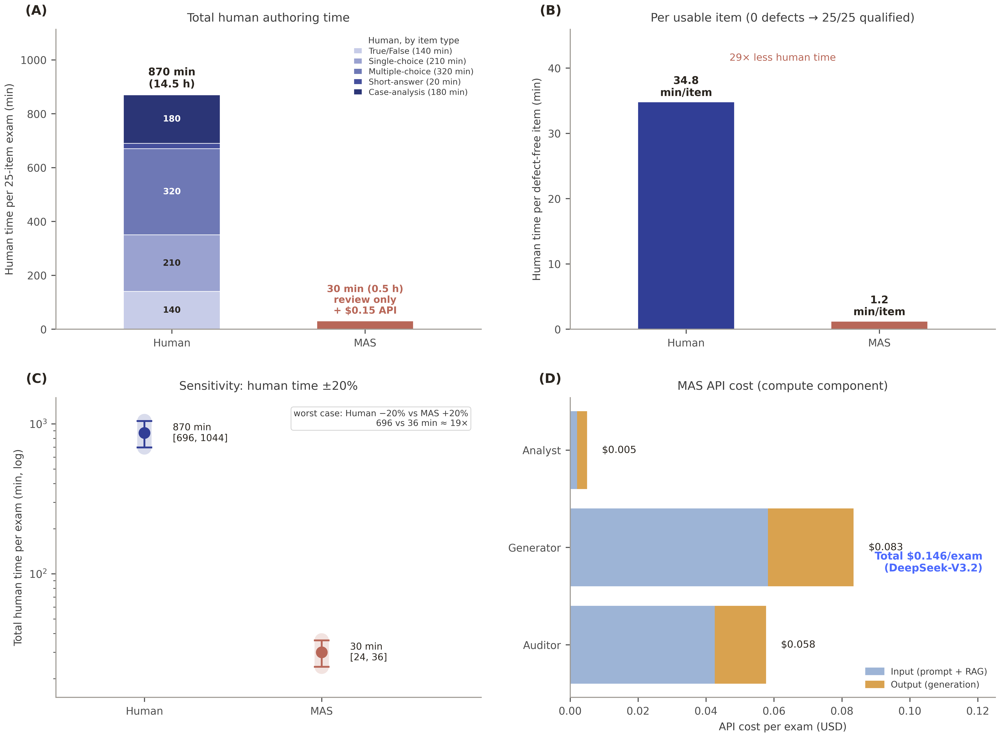

# 绘图逻辑

## Figure1

### 1A

整个项目的流程图。

### 1B

安全审核的详细流程图。

### 1C

从左到右三张柱形图。第一张左侧写Overall(n=70/group)，展示第一轮抽题Human70题、UroEmas70题的Major Defect数量（当然都是0）。第二张和第三张分别是低分段和中分段。因为缺少专家数据，具体绘图逻辑待定。

### 1D

类似1C，但按题型分类统计。因为缺少专家数据，具体绘图逻辑待定。

### 1E

两位专家Major Defect结论一致性。利用加权Kappa或Poisson/负二项模型计算。因为缺少专家数据，具体绘图逻辑待定。

## Figure2

### 2A

专家综合质量评估的详细流程图，包括QGEval评分、LLM评分、图灵测试、Major Defect等。

### 2B

比较70道题的专家评分35分总分/76分总分（平均分±标准差）之间的差异显著性。在下图（另一篇论文的图片）的(A)基础上出现两条虚线，分别是QGEval的δ = -2.00（35 分制），ULM的δ = -4.00（76 分制）；有两条线，一条是QGEval的UroEmas-Human，另一条是ULM的UroEmas-Human，“-”是减号。上标注具体数值以及95%置信区间。下图的(A)中有的其他元素也应在我们图中出现：

### 2C

比较专家在QGEval7维度和UML16维度每个维度上的（平均分±标准差）之间的差异显著性。δ = -0.30（5分制），δ = -0.25（4分制），δ = -0.20（3分制）,分制详见prompts\evaluation\prompt_for_qgeval.txt、prompts\evaluation\prompt_for_llm.txt。模仿上图的(B)，共23维度。上面7个QGEval维度和下面16个UML维度之间稍微分开一些，不显著则标注n.s，上图的(B)中有的其他元素也应在我们图中出现。

### 2D

展现不同认知层级的题目的专家质量评分差，差异显著性分析，模仿下图（另一篇论文的图片），但我们有QGEval和UML两种评分方式，因此要用两种颜色。

### 2E

专家评分source × cognitive_level交互模型，关键模型quality_score ~ source*cognitive_level + covariates + (1|rater_id)+(1|item_id)），画法和3D类似，做成箱图折线图，即做成两条折线这些折线连接点是箱图平均线的点，通过统计学方法比较每组箱图之间的差异。

### 2F

QGEval、ULM的ICC一致性分析。参考1E，但只有两行（QGEval、ULM）。

## Figure3

### 3A

学生测试过程的详细流程图。

### 3B

比较学生总分差异，并绘制类似下图（另一篇论文的图片）的小提琴图。左侧是不区分院区总分之间比较，右侧两张则是按院区分层之后的总分之间比较。首先采用 Kolmogorov-Smirnov 检验评估各组数据的正态性。若数据符合正态分布，则采用独立样本 t 检验进行两组比较；若数据不符合正态分布，则采用 Mann-Whitney U 检验进行两组比较。所有统计检验均采用双侧检验，双侧 P < 0.05 被认为差异具有统计学意义。图中使用 n.s.、*、**、*** 标注统计显著性。

### 3C

展现不同认知层级（记忆，理解，应用，分析）的题目的学生正确率比较。数据检验方式模仿3B；式样模仿2C。

### 3D

模仿下图（另一篇论文的图片）的(C)。但source × cognitive_level交互模型应该被理解为通过一个程序在控制了疲劳效应，院区差异，年级差异，AB分卷等种种干扰因素后再分别判断UroEmas与Human每种认知层级的正确率之间差异）做成箱图折线图，即做成两条折线这些折线连接点是箱图平均线的点，然后还可以通过统计学方法比较每组箱图之间的差异。

### 3E

模仿下图（另一篇论文的图片）的(D)。但CTT分析应该依旧以认知层级进行分类，其余还是和之前一样一边是正确率另一边是区分度（区分度算法是成绩前27%考生正确率-成绩后27%考生正确率）。

### 3F

UroEmas与Human卷的克伦巴赫指数图，画法是dot plot with bootstrap CI，分别是整张试卷，UroEmas卷和内部试卷，画法类似下图：
KR-20 / Cronbach's alpha

Overall examination      ─────●─────
Human block              ────●──────
UroEMAS block             ─────●────

0.0        0.5        0.7        1.0

## Figure4

### 4A

图灵测试的详细流程图。

### 4B

专家来源辨识准确率。分别是三位专家的准确率以及其90%CI，模仿下图（另一篇论文的图片），但要有3条线分别代表3位专家，底色是严格45-55%界值，如果有在底色之外的部分可以把40-60%之间其余部分标绿底色代表宽松界值，以及表格信息补全（如每种颜色代表每个专家的信息）。

### 4C

专家混淆矩阵。

### 4D

专家guessed_MAS模型森林图。
（以下内容供参考）：
"guessed_MAS 模型"指什么 
guessed = "被猜测为AI/被判定为人写"——即被试（或 MAS Agent 模拟被试）对每道题给出"我认为这是 AI 出的"判断（0/1 或 vote proportion）
MAS（Multi-Agent System） = 用多个 LLM Agent 模拟人类评判者，对题目做"人写 vs AI写"投票，汇总得到 guessed 概率/标签
guessed_MAS 模型 = 以 guessed（MAS 投票结果或人类投票汇总）为因变量（DV），建立二分类模型：
guessed_MAS ~ actual_source + question_type + difficulty + discipline + (1 | expert) + (1 | item)
即检验：题目真实来源（人/AI）、认知层级、及其交互是否影响被 MAS/人被判断为 AI 的概率。

### 4E

学生来源辨识准确率。由于是48学生对模块鉴别，因此画法和4B类似，只是这里的正确率是判断对的学生占48的人数，附上90%CI。

## Figure5

### A、B、C、D

模仿下图（另一篇论文的图片）：

## Figure6

疲劳效应分析。参考配色是紫色和土黄色。
